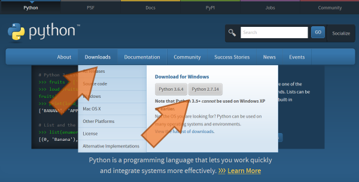
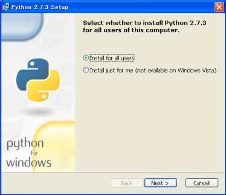

:orphan:

Installing Sphinx
=================

Since Sphinx is written in the Python language, you need to install Python
(the required version is at least 2.7) and Sphinx.

Sphinx packages are available on the `Python Package Index
<https://pypi.python.org/pypi/Sphinx>`_.

You can also download a snapshot from the Git repository:

* as a `.tar.gz <https://github.com/sphinx-doc/sphinx/archive/master.tar.gz>`__
  file or
* as a `.zip <https://github.com/sphinx-doc/sphinx/archive/master.zip>`_ file

There are introductions for several environments:

.. contents::
   :depth: 1
   :local:
   :backlinks: none

Debian/Ubuntu: Install Sphinx using packaging system
----------------------------------------------------

You may install using this command if you use Debian/Ubuntu.

.. code-block:: bash

   $ apt-get install python-sphinx

Other Linux distributions
-------------------------

Most Linux distributions have Sphinx in their package repositories.  Usually the
package is called "python-sphinx", "python-Sphinx" or "sphinx".  Be aware that
there are two other packages with "sphinx" in their name: a speech recognition
toolkit (CMU Sphinx) and a full-text search database (Sphinx search).

Mac OS X: Install Sphinx using MacPorts
---------------------------------------

If you use Mac OS X `MacPorts <http://www.macports.org/>`_, use this command to
install all necessary software.

.. code-block:: bash

   $ sudo port install py27-sphinx

To set up the executable paths, use the ``port select`` command:

.. code-block:: bash

   $ sudo port select --set python python27
   $ sudo port select --set sphinx py27-sphinx

Type :command:`which sphinx-quickstart` to check if the installation was
successful.

Windows: Install Python and Sphinx
----------------------------------

Install Python
^^^^^^^^^^^^^^

Most Windows users do not have Python, so we begin with the installation of
Python itself.  If you have already installed Python, please skip this section.

Go to https://www.python.org/, the main download site for Python. Look at the left
sidebar and under "Quick Links", click "Windows Installer" to download.

.. note::

   Currently, Python offers two major versions, 2.x and 3.x. Sphinx 1.3 can run
   under Python 2.7, 3.4, 3.5, with the recommended version being 2.7.  This
   chapter assumes you have installed Python 2.7.

Follow the Windows installer for Python.

After installation, you better add the Python executable directories to the
environment variable ``PATH`` in order to run Python and package commands such
as ``sphinx-build`` easily from the Command Prompt.

* Right-click the "My Computer" icon and choose "Properties"
* Click the "Environment Variables" button under the "Advanced" tab

* If "Path" (or "PATH") is already an entry in the "System variables" list, edit
  it.  If it is not present, add a new variable called "PATH".

* Add these paths, separating entries by ";":

  - ``C:\Python27`` -- this folder contains the main Python executable
  - ``C:\Python27\Scripts`` -- this folder will contain executables added by
    Python packages installed with pip (see below)

  This is for Python 2.7.  If you use another version of
  Python or installed to a non-default location, change the digits "27"
  accordingly.

* Now run the **Command Prompt**.  After command prompt window appear, type
  ``python`` and Enter.  If the Python installation was successful, the
  installed Python version is printed, and you are greeted by the prompt
  ``>>>``.  Type ``Ctrl+Z`` and Enter to quit.

Install the pip command
^^^^^^^^^^^^^^^^^^^^^^^

Python has a very useful :command:`pip` command which can download and install
3rd-party libraries with a single command. This is provided by the
Python Packaging Authority(PyPA):
https://groups.google.com/forum/#!forum/pypa-dev

To install pip, download https://bootstrap.pypa.io/get-pip.py and
save it somewhere.  After download, invoke the command prompt, go to the
directory with ``get-pip.py`` and run this command:

.. code-block:: bat

   C:\> python get-pip.py

Now :command:`pip` command is installed.  From there we can go to the Sphinx
install.

.. note::

   ``pip`` has been contained in the Python official installation after version
   of Python-3.4.0 or Python-2.7.9.

Installing Sphinx with pip
--------------------------

If you finished the installation of pip, type this line in the command prompt:

.. code-block:: bat

   C:\> pip install sphinx

After installation, type :command:`sphinx-build -h` on the command prompt.  If
everything worked fine, you will get a Sphinx version number and a list of
options for this command.

That it.  Installation is over.  Head to :doc:`tutorial` to make a Sphinx
project.
