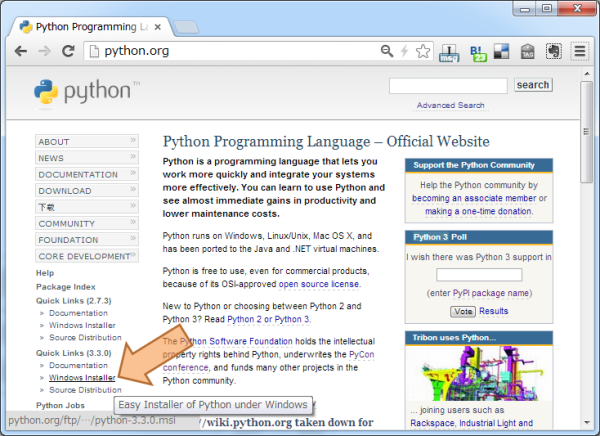

:orphan:

Installing Sphinx
==================

Sphinx is written by Python, you need to install Python and Sphinx.

Sphinx package is available as a package on the `Python Package Index
<http://pypi.python.org/pypi/Sphinx>`_.

You can also download a snapshot from the Mercurial development repository:

* as a `.tar.bz2 <https://bitbucket.org/birkenfeld/sphinx/get/default.tar.bz2>`_
  file or
* as a `.zip <https://bitbucket.org/birkenfeld/sphinx/get/default.zip>`_ file

There is introductions for each environments:

.. contents::
   :depth: 1
   :local:
   :backlinks: none

Install by your own
--------------------

If you use system installed Python or build your own Python, you can
use that python to install Sphinx. The actual command list is same as
these install.

* `Install easy_install command`_
* `Install Sphinx`_

Debian/Ubuntu: Install Sphinx using packaging system
-----------------------------------------------------

You may install using this command if you use Debian/Ubuntu.

.. code-block:: bash

   $ aptitude install python-sphinx

Mac OS X: Install Sphinx using MacPorts
----------------------------------------

If you use Mac OS X `MacPorts <http://www.macports.org/>`_ , use this
command to install all software.

.. code-block:: bash

   $ sudo port install py27-sphinx

However, the execution path is not added, use select command to use
Python2.7 as default.

.. code-block:: bash

   $ sudo port select --set python python27
   $ sudo port select --set sphinx py27-sphinx

Type :command:`which sphinx-quickstart` to check the installation.

Windows: Install Python and Sphinx
-----------------------------------

Intall Python
^^^^^^^^^^^^^^

Almost every Windows user do not have Python, we begin Python
installation. If you already install python, please skip this section.

Go to http://python.org . This site is a headquarter of the
Python. Look at Left sidebar and "Quick Links", Click "Windows
Installer" to download.

.. note::

   Currently, Python has two version, 2.X and 3.X. Sphinx-1.2 can
   run under Python-2.5, 2.6, 2.7, 3.1, 3.2, 3.3.
   You may get some advice from ML or other places.

   This chapter assumes Python-2.7.

Follow the normal Windows installer, the Python install will be completed.

.. image:: installpython.jpg

After installation, you have better to add PATH to the Environment
Variable in order to run Python from Command Prompt.

* Right-Click the My Computer Icon and open Property Dialog
* Click Environment Variable button under detail tab
* Edit and add the path to the system variables PATH 

Add these variables. This is for Python-2.7. If you use another version
of Python, change the "27" number. Add these pathes separeted by ";".

.. list-table:: Adding PATH
   :widths: 10 40
   :header-rows: 1

   * - PATH
     - description
   * - C:\\Python27
     - Folder which includes Python Command
   * - C:\\Python27\\Scripts
     - Folder which includes easy_install (described later) or sphinx commands

Run **Command Prompt** or enter ``cmd`` to the "search program and
files" text box. After command prompt window appear, type
``python[Enter]``. If you can get installed python version and prompt
about ``>>>``, the Python installation is succeeded.  Enter ``Ctrl+Z``
key to quit.

Install easy_install command
^^^^^^^^^^^^^^^^^^^^^^^^^^^^^

Python has very useful :command:`easy_install` command which install 3rd
party library.

* http://pypi.python.org/pypi/distribute

easy_install downloads and install software which you want to need by only
one command.

Save http://distribute.org/distribute_setup.py link by Right-click.
Some browsers can download just open the URL.
If you can read the file iteslf, calm down, Right-click and choose "Save".

After download, invoke command prompt, go to the distribute_setup.py saved
directory and run this command:

.. code-block:: bat

   C:\> python distribute_setup.py

Now :command:`easy_insall` command is installed. OK, Let's go to the Sphinx
install!

Install Sphinx
^^^^^^^^^^^^^^^

If you finshed easy_install install, for the rest is just a moment.
Type this line.

.. code-block:: bat

   C:\> easy_install sphinx

After installation, type :command:`sphinx-quickstart` on the command
prompt. If you get interactive messages which starts with
``Welcome to the Sphinx <version> quickstart utility.``,
installation is succeeded. Quit by hitting ``Ctrl+C``.

That it. Install is over. Let's go to :doc:`tutorial` to make Sphinx project.

