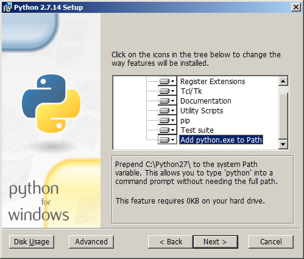

:orphan:

Installing Sphinx
=================

Since Sphinx is written in the Python language, you need to install Python
(the required version is at least 2.7) and Sphinx.

Sphinx packages are available on the `Python Package Index
<https://pypi.python.org/pypi/Sphinx>`_.

You can also download a snapshot from the Git repository:

* as a `.tar.gz <https://github.com/sphinx-doc/sphinx/archive/master.tar.gz>`__
  file or
* as a `.zip <https://github.com/sphinx-doc/sphinx/archive/master.zip>`_ file

There are introductions for several environments:

.. contents::
   :depth: 1
   :local:
   :backlinks: none

Debian/Ubuntu: Install Sphinx using packaging system
----------------------------------------------------

You may install using this command if you use Debian/Ubuntu.

.. code-block:: bash

   $ apt-get install python-sphinx

Other Linux distributions
-------------------------

Most Linux distributions have Sphinx in their package repositories.  Usually the
package is called "python-sphinx", "python-Sphinx" or "sphinx".  Be aware that
there are two other packages with "sphinx" in their name: a speech recognition
toolkit (CMU Sphinx) and a full-text search database (Sphinx search).

Mac OS X: Install Sphinx using MacPorts
---------------------------------------

If you use Mac OS X `MacPorts <https://www.macports.org/>`_, use this command to
install all necessary software.

.. code-block:: bash

   $ sudo port install py27-sphinx

To set up the executable paths, use the ``port select`` command:

.. code-block:: bash

   $ sudo port select --set python python27
   $ sudo port select --set sphinx py27-sphinx

Type :command:`which sphinx-quickstart` to check if the installation was
successful.

Windows: Install Python and Sphinx
----------------------------------

Install Python
^^^^^^^^^^^^^^

Most Windows users do not have Python, so we begin with the
installation of Python itself.  If you have already installed
Python, please skip to the next section.

.. note::

   Currently, Python offers two major versions, 2.x and 3.x. Sphinx 1.6 can run
   under Python 2.7, 3.4, 3.5, 3.6, with the recommended version being 2.7.  This
   chapter assumes you are installing Python 2.7.

Go to https://www.python.org/, the main download site for Python.
Hover over the "Downloads" menu and select a Python version to download.

.. image:: pythonorg.png

Follow the Windows installer for Python.  When you reach the screen that
lets you customize the installation, scroll to the bottom of the list
and change "Add python.exe to Path" so that it will be installed.

Now run the **Command Prompt**.  After the command prompt window appears, type
``python`` and Enter.  If the Python installation was successful, the
installed Python version is printed, and you are greeted by the prompt
``>>>``:

.. code-block:: text

   C:\>python
   Python 2.7.14 (v2.7.14:84471935ed, Sep 16 2017, 20:19:30) [MSC v.1500 32 bit (Intel)] on win32
   Type "help", "copyright", "credits" or "license" for more information.
   >>>

Type ``Ctrl+Z`` and ``Enter`` to quit.

Install Sphinx using pip
^^^^^^^^^^^^^^^^^^^^^^^^

Type this line in the command prompt:

.. code-block:: text

   C:\>pip install sphinx

After installation, type :command:`sphinx-build -h` on the command prompt.  If
everything worked fine, you will get a Sphinx version number and a list of
options for this command.

That it.  Installation is over.  Head to :doc:`tutorial` to make a Sphinx
project.
