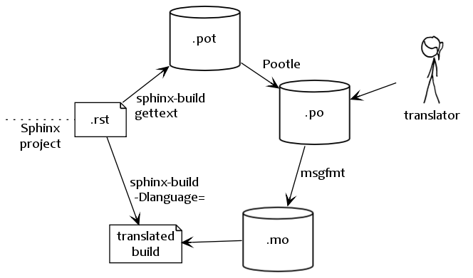

.. _intl:

Internationalization
====================

.. versionadded:: 1.1

Complementary to translations provided for Sphinx-generated messages such as
navigation bars, Sphinx provides mechanisms facilitating *document* translations
in itself.  See the :ref:`intl-options` for details on configuration.

   Workflow visualization of translations in Sphinx.  (The stick-figure is taken
   from an `XKCD comic <http://xkcd.com/779/>`_.)

**gettext** [1]_ is an established standard for internationalization and
localization.  It naïvely maps messages in a program to a translated string.
Sphinx uses these facilities to translate whole documents.

Initially project maintainers have to collect all translatable strings (also
referred to as *messages*) to make them known to translators.  Sphinx extracts
these through invocation of ``sphinx-build -b gettext``.

Every single element in the doctree will end up in a single message which
results in lists being equally split into different chunks while large
paragraphs will remain as coarsely-grained as they were in the original
document.  This grants seamless document updates while still providing a little
bit of context for translators in free-text passages.  It is the maintainer's
task to split up paragraphs which are too large as there is no sane automated
way to do that.

After Sphinx successfully ran the
:class:`~sphinx.builders.gettext.MessageCatalogBuilder` you will find a collection
of ``.pot`` files in your output directory.  These are **catalog templates**
and contain messages in your original language *only*.

They can be delivered to translators which will transform them to ``.po`` files
--- so called **message catalogs** --- containing a mapping from the original
messages to foreign-language strings.

Gettext compiles them into a binary format known as **binary catalogs** through
:program:`msgfmt` for efficiency reasons.  If you make these files discoverable
with :confval:`locale_dirs` for your :confval:`language`, Sphinx will pick them
up automatically.

An example: you have a document ``usage.rst`` in your Sphinx project.  The
gettext builder will put its messages into ``usage.pot``.  Imagine you have
Spanish translations [2]_ on your hands in ``usage.po`` --- for your builds to
be translated you need to follow these instructions:

* Compile your message catalog to a locale directory, say ``translated``, so it
  ends up in ``./translated/es/LC_MESSAGES/usage.mo`` in your source directory
  (where ``es`` is the language code for Spanish.) ::

        msgfmt "usage.po" -o "translated/es/LC_MESSAGES/usage.mo"

* Set :confval:`locale_dirs` to ``["translated/"]``.
* Set :confval:`language` to ``es`` (also possible via :option:`-D`).
* Run your desired build.

.. rubric:: Footnotes

.. [1] See the `GNU gettext utilites
       <http://www.gnu.org/software/gettext/manual/gettext.html#Introduction>`_
       for details on that software suite.
.. [2] Because nobody expects the Spanish Inquisition!
