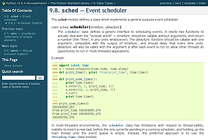
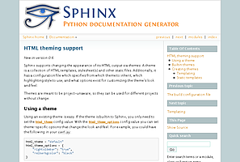
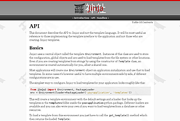
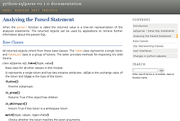
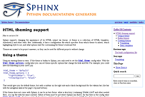
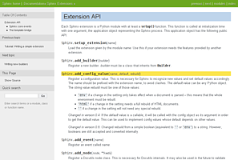
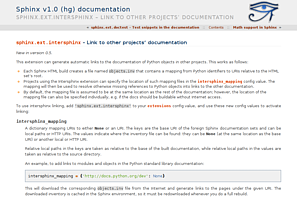
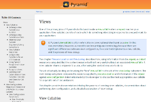

.. highlightlang:: python

HTML theming support
====================

.. versionadded:: 0.6

Sphinx supports changing the appearance of its HTML output via *themes*.  A
theme is a collection of HTML templates, stylesheet(s) and other static files.
Additionally, it has a configuration file which specifies from which theme to
inherit, which highlighting style to use, and what options exist for customizing
the theme's look and feel.

Themes are meant to be project-unaware, so they can be used for different
projects without change.

Using a theme
-------------

Using an existing theme is easy.  If the theme is builtin to Sphinx, you only
need to set the :confval:`html_theme` config value.  With the
:confval:`html_theme_options` config value you can set theme-specific options
that change the look and feel.  For example, you could have the following in
your :file:`conf.py`::

    html_theme = "default"
    html_theme_options = {
        "rightsidebar": "true",
        "relbarbgcolor": "black"
    }

That would give you the default theme, but with a sidebar on the right side and
a black background for the relation bar (the bar with the navigation links at
the page's top and bottom).

If the theme does not come with Sphinx, it can be in two forms: either a
directory (containing :file:`theme.conf` and other needed files), or a zip file
with the same contents.  Either of them must be put where Sphinx can find it;
for this there is the config value :confval:`html_theme_path`.  It gives a list
of directories, relative to the directory containing :file:`conf.py`, that can
contain theme directories or zip files.  For example, if you have a theme in the
file :file:`blue.zip`, you can put it right in the directory containing
:file:`conf.py` and use this configuration::

    html_theme = "blue"
    html_theme_path = ["."]

.. _builtin-themes:

Builtin themes
--------------

.. cssclass:: right

+--------------------+--------------------+
| **Theme overview** |                    |
+--------------------+--------------------+
| |default|          | |sphinxdoc|        |
|                    |                    |
| *default*          | *sphinxdoc*        |
+--------------------+--------------------+
| |scrolls|          | |agogo|            |
|                    |                    |
| *scrolls*          | *agogo*            |
+--------------------+--------------------+
| |traditional|      | |nature|           |
|                    |                    |
| *traditional*      | *nature*           |
+--------------------+--------------------+
| |haiku|            | |pyramid|          |
|                    |                    |
| *haiku*            | *pyramid*          |
+--------------------+--------------------+

Sphinx comes with a selection of themes to choose from.

These themes are:

* **basic** -- This is a basically unstyled layout used as the base for the
  other themes, and usable as the base for custom themes as well.  The HTML
  contains all important elements like sidebar and relation bar.  There are
  these options (which are inherited by the other themes):

  - **nosidebar** (true or false): Don't include the sidebar.  Defaults to
    false.

  - **sidebarwidth** (an integer): Width of the sidebar in pixels.  (Do not
    include ``px`` in the value.)  Defaults to 230 pixels.

* **default** -- This is the default theme, which looks like `the Python
  documentation <http://docs.python.org/>`_.  It can be customized via these
  options:

  - **rightsidebar** (true or false): Put the sidebar on the right side.
    Defaults to false.

  - **stickysidebar** (true or false): Make the sidebar "fixed" so that it
    doesn't scroll out of view for long body content.  This may not work well
    with all browsers.  Defaults to false.

  - **collapsiblesidebar** (true or false): Add an *experimental* JavaScript
    snippet that makes the sidebar collapsible via a button on its side.
    *Doesn't work together with "rightsidebar" or "stickysidebar".* Defaults to
    false.

  - **externalrefs** (true or false): Display external links differently from
    internal links.  Defaults to false.

  There are also various color and font options that can change the color scheme
  without having to write a custom stylesheet:

  - **footerbgcolor** (CSS color): Background color for the footer line.
  - **footertextcolor** (CSS color): Text color for the footer line.
  - **sidebarbgcolor** (CSS color): Background color for the sidebar.
  - **sidebarbtncolor** (CSS color): Background color for the sidebar collapse
    button (used when *collapsiblesidebar* is true).
  - **sidebartextcolor** (CSS color): Text color for the sidebar.
  - **sidebarlinkcolor** (CSS color): Link color for the sidebar.
  - **relbarbgcolor** (CSS color): Background color for the relation bar.
  - **relbartextcolor** (CSS color): Text color for the relation bar.
  - **relbarlinkcolor** (CSS color): Link color for the relation bar.
  - **bgcolor** (CSS color): Body background color.
  - **textcolor** (CSS color): Body text color.
  - **linkcolor** (CSS color): Body link color.
  - **visitedlinkcolor** (CSS color): Body color for visited links.
  - **headbgcolor** (CSS color): Background color for headings.
  - **headtextcolor** (CSS color): Text color for headings.
  - **headlinkcolor** (CSS color): Link color for headings.
  - **codebgcolor** (CSS color): Background color for code blocks.
  - **codetextcolor** (CSS color): Default text color for code blocks, if not
    set differently by the highlighting style.

  - **bodyfont** (CSS font-family): Font for normal text.
  - **headfont** (CSS font-family): Font for headings.

* **sphinxdoc** -- The theme used for this documentation.  It features a sidebar
  on the right side.  There are currently no options beyond *nosidebar* and
  *sidebarwidth*.

* **scrolls** -- A more lightweight theme, based on `the Jinja documentation
  <http://jinja.pocoo.org/>`_.  The following color options are available:

  - **headerbordercolor**
  - **subheadlinecolor**
  - **linkcolor**
  - **visitedlinkcolor**
  - **admonitioncolor**

* **agogo** -- A theme created by Andi Albrecht.  The following options are
  supported:

  - **bodyfont** (CSS font family): Font for normal text.
  - **headerfont** (CSS font family): Font for headings.
  - **pagewidth** (CSS length): Width of the page content, default 70em.
  - **documentwidth** (CSS length): Width of the document (without sidebar),
    default 50em.
  - **sidebarwidth** (CSS length): Width of the sidebar, default 20em.
  - **bgcolor** (CSS color): Background color.
  - **headerbg** (CSS value for "background"): background for the header area,
    default a grayish gradient.
  - **footerbg** (CSS value for "background"): background for the footer area,
    default a light gray gradient.
  - **linkcolor** (CSS color): Body link color.
  - **headercolor1**, **headercolor2** (CSS color): colors for <h1> and <h2>
    headings.
  - **headerlinkcolor** (CSS color): Color for the backreference link in
    headings.
  - **textalign** (CSS *text-align* value): Text alignment for the body, default
    is ``justify``.

* **nature** -- A greenish theme.  There are currently no options beyond
  *nosidebar* and *sidebarwidth*.

* **pyramid** -- A theme from the Pyramid web framework project, designed by
  Blaise Laflamme.  There are currently no options beyond *nosidebar* and
  *sidebarwidth*.

* **haiku** -- A theme without sidebar inspired by the `Haiku OS user guide
  <http://www.haiku-os.org/docs/userguide/en/contents.html>`_.  The following
  options are supported:

  - **full_logo** (true or false, default false): If this is true, the header
    will only show the :confval:`html_logo`.  Use this for large logos.  If this
    is false, the logo (if present) will be shown floating right, and the
    documentation title will be put in the header.
  - **textcolor**, **headingcolor**, **linkcolor**, **visitedlinkcolor**,
    **hoverlinkcolor** (CSS colors): Colors for various body elements.

* **traditional** -- A theme resembling the old Python documentation.  There are
  currently no options beyond *nosidebar* and *sidebarwidth*.

* **epub** -- A theme for the epub builder.  There are currently no options.
  This theme tries to save visual space which is a sparse resource on ebook
  readers.

Creating themes
---------------

As said, themes are either a directory or a zipfile (whose name is the theme
name), containing the following:

* A :file:`theme.conf` file, see below.
* HTML templates, if needed.
* A ``static/`` directory containing any static files that will be copied to the
  output static directory on build.  These can be images, styles, script files.

The :file:`theme.conf` file is in INI format [1]_ (readable by the standard
Python :mod:`ConfigParser` module) and has the following structure:

.. sourcecode:: ini

    [theme]
    inherit = base theme
    stylesheet = main CSS name
    pygments_style = stylename

    [options]
    variable = default value

* The **inherit** setting gives the name of a "base theme", or ``none``.  The
  base theme will be used to locate missing templates (most themes will not have
  to supply most templates if they use ``basic`` as the base theme), its options
  will be inherited, and all of its static files will be used as well.

* The **stylesheet** setting gives the name of a CSS file which will be
  referenced in the HTML header.  If you need more than one CSS file, either
  include one from the other via CSS' ``@import``, or use a custom HTML template
  that adds ``<link rel="stylesheet">`` tags as necessary.  Setting the
  :confval:`html_style` config value will override this setting.

* The **pygments_style** setting gives the name of a Pygments style to use for
  highlighting.  This can be overridden by the user in the
  :confval:`pygments_style` config value.

* The **options** section contains pairs of variable names and default values.
  These options can be overridden by the user in :confval:`html_theme_options`
  and are accessible from all templates as ``theme_<name>``.

Templating
~~~~~~~~~~

The :doc:`guide to templating <templating>` is helpful if you want to write your
own templates.  What is important to keep in mind is the order in which Sphinx
searches for templates:

* First, in the user's ``templates_path`` directories.
* Then, in the selected theme.
* Then, in its base theme, its base's base theme, etc.

When extending a template in the base theme with the same name, use the theme
name as an explicit directory: ````.  From a
user ``templates_path`` template, you can still use the "exclamation mark"
syntax as described in the templating document.

Static templates
~~~~~~~~~~~~~~~~

Since theme options are meant for the user to configure a theme more easily,
without having to write a custom stylesheet, it is necessary to be able to
template static files as well as HTML files.  Therefore, Sphinx supports
so-called "static templates", like this:

If the name of a file in the ``static/`` directory of a theme (or in the user's
static path, for that matter) ends with ``_t``, it will be processed by the
template engine.  The ``_t`` will be left from the final file name.  For
example, the *default* theme has a file ``static/default.css_t`` which uses
templating to put the color options into the stylesheet.  When a documentation
is built with the default theme, the output directory will contain a
``_static/default.css`` file where all template tags have been processed.

.. [1] It is not an executable Python file, as opposed to :file:`conf.py`,
       because that would pose an unnecessary security risk if themes are
       shared.

